### Important
```
LuckyPal IT started this project from Feb 2014 and last version is launched at May 2019.
Under NDA sign, we can't public source and requirement documents, but you can check project under agreement.
```

# Karenderia Multiple Restaurant System
Karenderia Multiple Restaurant System is a restaurant food ordering and restaurant membership system.

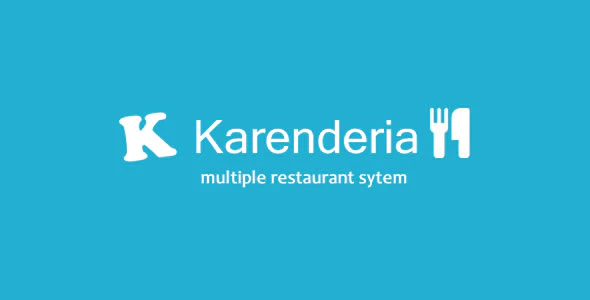

## Video Tutorials

- [How to install KMRS](https://youtu.be/WD8QfGYTZb4)
- [How to create google api key](https://youtu.be/P5p58U-k44k)
- [How to translate](https://youtu.be/FaQFRX9xEJY)
- [How to set default language](https://youtu.be/Ugl2ilxBbhM)
- [How to set facebook login](https://youtu.be/SY8jzPy-CGM)


## Payment Gateway Supported
- Paypal
- Stripe
- Mercapago
- Sisow
- PayuMoney
- Offline Bank Deposit
- Paysera
- Pay on Delivery
- BarclayCard
- Authorize.net
- Braintree
- Razorpay
- Voguepay

## SMS Gateway Supported
- Twilio
- Nexmo
- Clickatell
- SMSGlobal
- swift SMS
- SolutionInfini
- Plivo
- msg91
- Spot-hit


## Front End
[http://bastisapp.com/kmrs/](http://bastisapp.com/kmrs/)


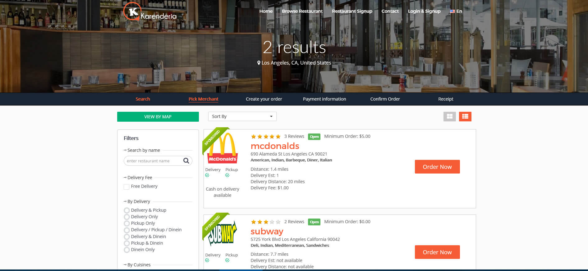
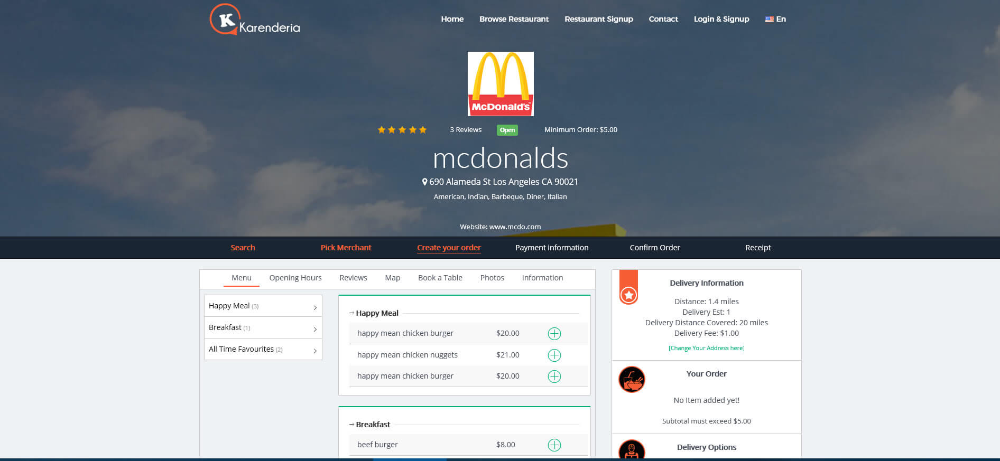
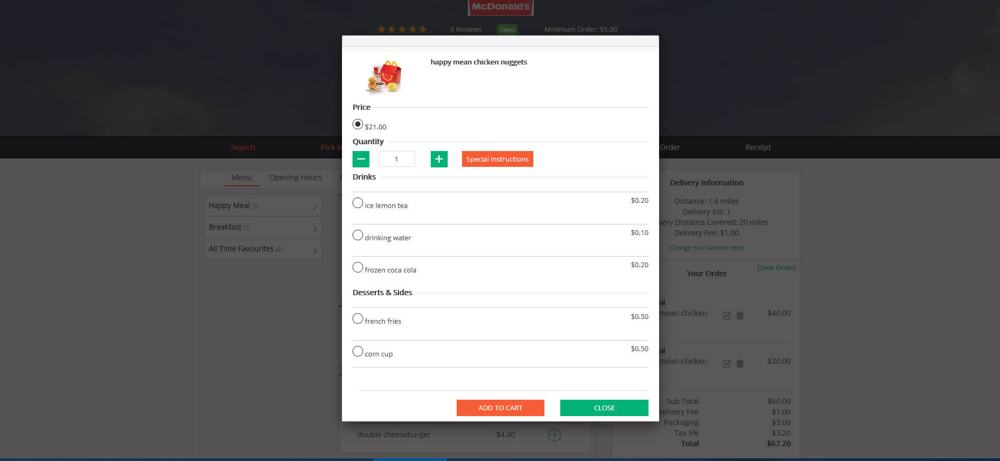
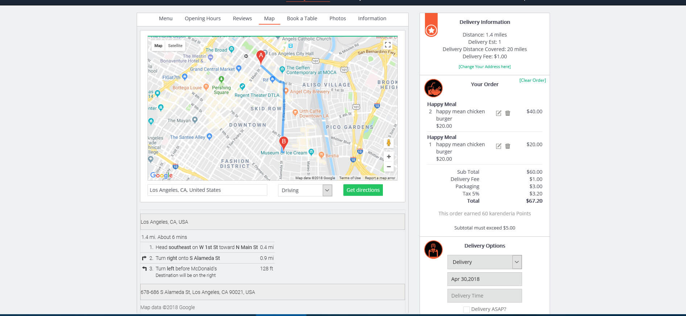
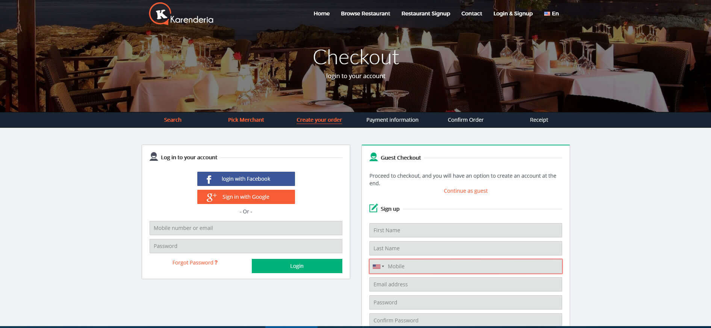
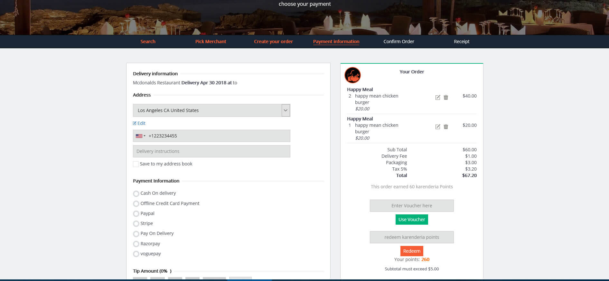
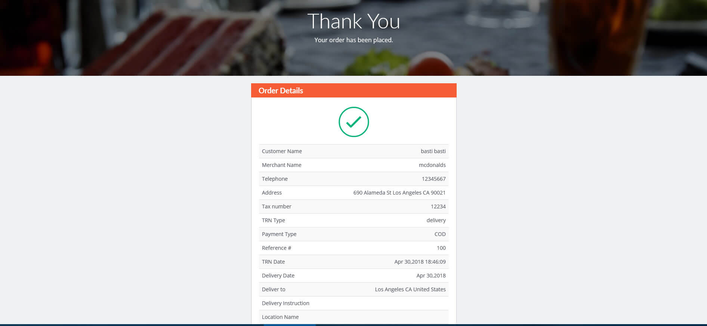
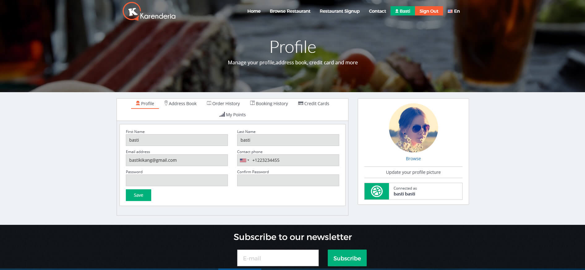
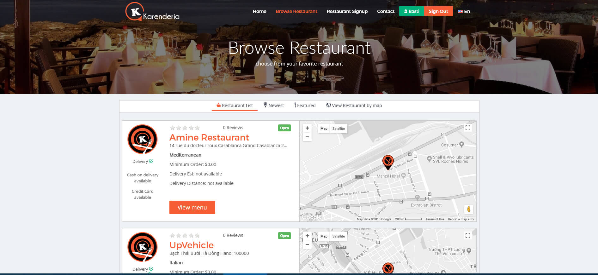

## App

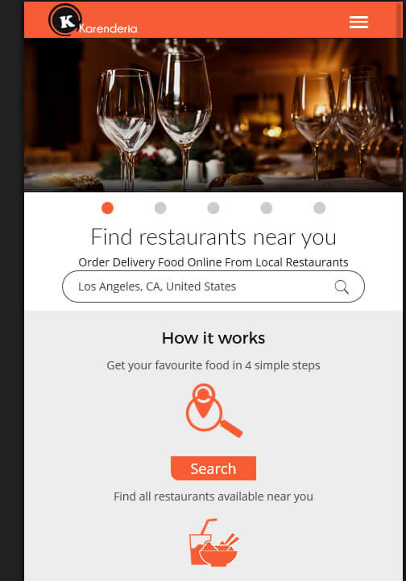 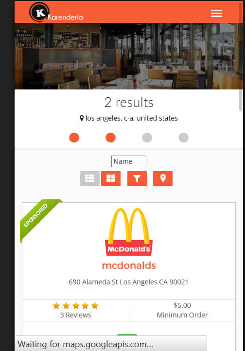 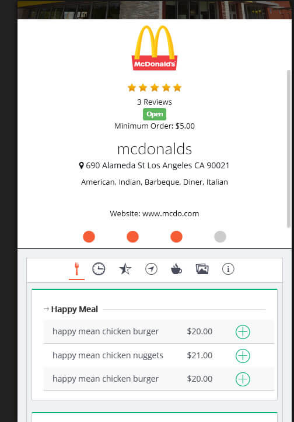 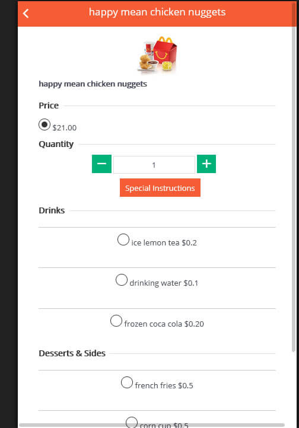


## Merchant Login
[http://bastisapp.com/kmrs/merchant/](http://bastisapp.com/kmrs/merchant/)
Login for mcdonalds merchant :
- Username : mcdo
- Password : mcdo

OR
- Username : subway
- Password : subway

## Administrator Login
[http://bastisapp.com/kmrs/admin](http://bastisapp.com/kmrs/admin)

- Username : admin
- Password : admin
- Paypal Sample Buyer account
- User/Email : buyer2@codemywebapps.com
- Password : Buyertestaccount

## Merchant Administration Features
- Easy to manage food item
- Manage addon category
- Size’s for food item eg. smal or large
- Has Option for cooking reference eg. Well done, Medium rare etc
- Manage address , tax , delivery charges , Receipt Message etc.
- Send email notification to owner once there is new order.

Payment Gateway
- Accept payment using paypal. you can set the paypal to sandbox for testing.
- Accept Payment using offline credit cards

Reports
- Sales report
- Sales report by item
- Sales summary report
- All reports can be exported to excel csv file

Charts
- Sales charts for last 30 days
- Sales charts by item

## Admin Features

Sponsored Listing
- You can simply add any merchant to be on top of the search results.

Membership Packages
- Add your own membership with expiration date and price.
- Package discount

Payment Gateway
- Collect payment using paypal
- Collect payment using offline credit cards.

Social Network
- facebook login
- Social network link

Charts & Reports
- Merchant membership paymentt reports
- Merchant Registration report

Requirements
- PHP Version 5.3.1 to 7.2
- MySQL client version: 5.1.41 or higher
- PDO Installed
- CURL Open
- Session enabled
- Mail functions enabled
- Mod_Rewrite Module Enabled

## License

```
Copyright (c) 2019 LuckyPal IT

Permission is hereby granted, free of charge, to any person obtaining a copy
of this software and associated documentation files (the "Software"), to deal
in the Software without restriction, including without limitation the rights
to use, copy, modify, merge, publish, distribute, sublicense, and/or sell
copies of the Software, and to permit persons to whom the Software is
furnished to do so, subject to the following conditions:

The above copyright notice and this permission notice shall be included in all
copies or substantial portions of the Software.

THE SOFTWARE IS PROVIDED "AS IS", WITHOUT WARRANTY OF ANY KIND, EXPRESS OR
IMPLIED, INCLUDING BUT NOT LIMITED TO THE WARRANTIES OF MERCHANTABILITY,
FITNESS FOR A PARTICULAR PURPOSE AND NONINFRINGEMENT. IN NO EVENT SHALL THE
AUTHORS OR COPYRIGHT HOLDERS BE LIABLE FOR ANY CLAIM, DAMAGES OR OTHER
LIABILITY, WHETHER IN AN ACTION OF CONTRACT, TORT OR OTHERWISE, ARISING FROM,
OUT OF OR IN CONNECTION WITH THE SOFTWARE OR THE USE OR OTHER DEALINGS IN THE
SOFTWARE.
```
